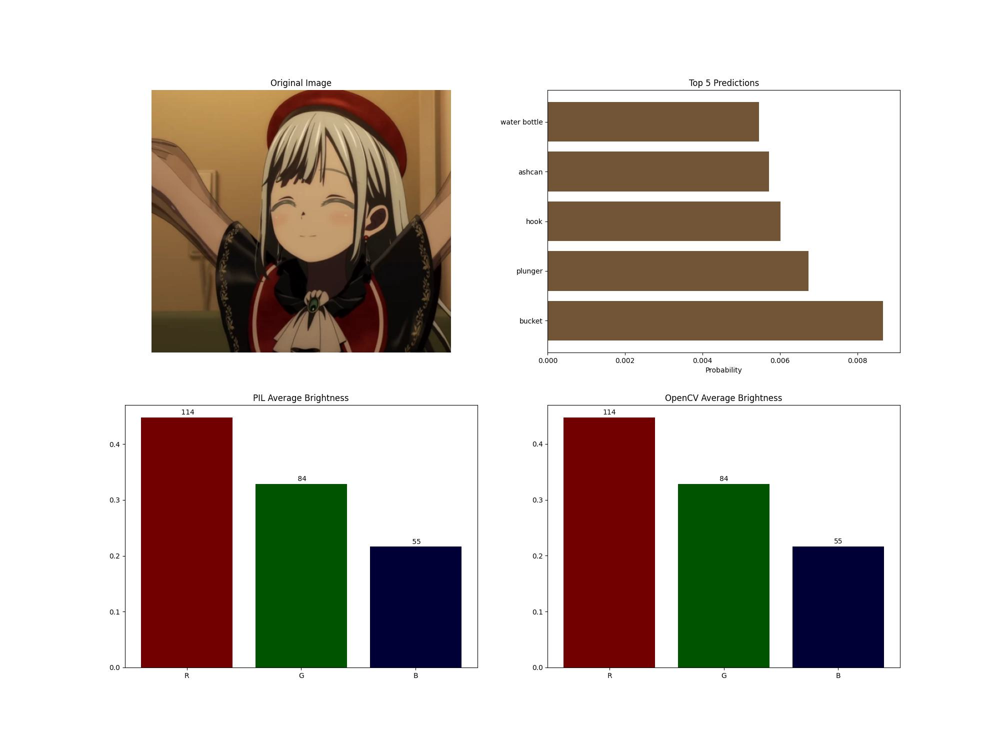

### 功能
- 加载预训练的`resnet-18`对图片进行分类
- 用PIL和OpenCV读取图片三个通道的平均亮度
- 可视化

---
### 展示


### 使用

- 待分类图片放入`input_img`文件夹
- 运行`SE1_1.py`
- 图片分类结果及平均亮度计算结果输出在`classify_img`

---
### 文件夹结构
```cmd
│  imagenet_classes.txt \\ imagenet类别
│  readme.md
│  report.md \\报告文档
│  report.pdf \\报告文档
│  requirements.txt
│  SE1.py
│  SE1_1.py
│
├─classify_img \\输出图片文件夹
│      1739949031750_bucket_classified.jpg
│      20210101142830_bucket_classified.jpg
│      OIP-C_bucket_classified.jpg
│      R-C_bucket_classified.jpg
│      Screenshot_2025-02-26-19-01-11-413_bucket_classified.jpg
│
├─input_img \\ 输入图片文件夹
│      1739949031750.jpg
│      20210101142830.jpg
│      OIP-C.jpg
│      R-C.jpg
│      Screenshot_2025-02-26-19-01-11-413.png
│
└─judge
```
---
